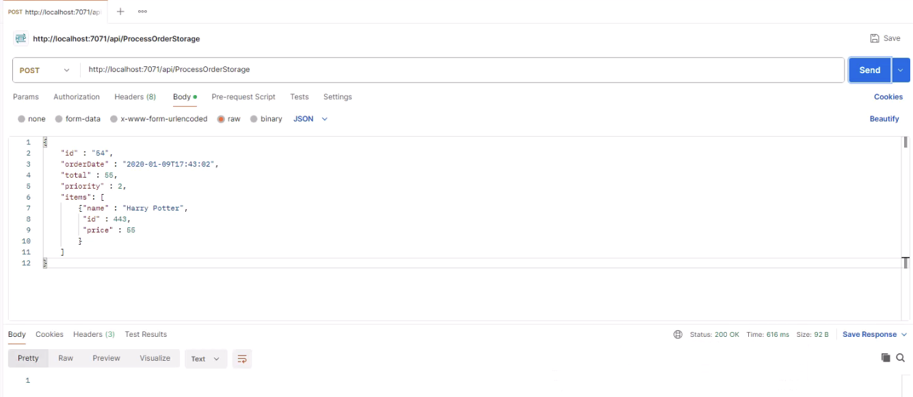

# The "Internet Bookshop" project based on .Net >=8 version

### Run the project localy (catalog):

```bash 
dotnet publish -o publish
```
- then your code is ready to deploy to VM.
- configure the local server (IIS) with 'Web server' role.
- Install the 'Hosting Bundles' to the VM.

### Run the project localy (inventory and catalog):

```bash
dotnet build
dotnet run
```
Then open the browser on http://localhost:5002 for the 'inventory' site & open http://localhost:5000/ for the 'catalog' site.

### The Weather API. (OPTIONAL)

- The 'catalog' app contains the widget  of the 'Weather API'. To access it, you need to run a new VM (Ubuntu) in the same place ('Vnet') when 'catalog'.
- In the VM, just run the commands in bash:
``` bash
sudo apt install git
sudo apt update
sudo apt install nodejs
sudo git clone https://github.com/memilavi/weatherAPI.git
cd weatherAPI
sudo apt install npm
npm start
```

## Run the project 'inventory' on the 'Azure App Service'

- Create the Web App on portal.
- Click on "Deploy to Web App" from the left side window.
- Make sure to login and check the status on the Azure portal.

## 'Cart' folder

"It's a shoping cart of the project. The deployment is the similar inventory - local deployment, but contains the another way to deploy to the portal - docker image wich will be leverage with services: ACR and AKS.
Contains: Dockerfile for ACR, and deployment.yml file for AKS."

## 'Order' folder

The most important files in this project are these two:
- the 'ProcessOrderCosmos' and the 'ProcessOrderStorage'.

These two files are basically the two functions that are going to be part of our function app. And one of them is going to process the orders and store them in the Cosmos DB. And the second one is going to store them in storage account.

The file 'ordersample.json' will use to test the functions.
The file 'Order.cs' is just a class that representing the order.
The 'local.settings.json' file contains the connecting settings to 'CosmosDB' & storage account.

### Running functions locally:

press 'F5' in VScode directory 'order' to build & run the functions.
* We will have two URLs. Currently the functions are running locally.
* Note that this is a local URL.
so, going to test these functions by calling the URL, going to do that using Postman - install the 'Postman' first.
Then copy (e.g. storage link):

http://localhost:7071/api/ProcessOrderStorage
http://localhost:7071/api/ProcessOrderCosmos



## Deploy functions to Azure.

Open 'Function App' and create 'New'. Choose the plan (e.g. Consumption), fill up the lines, next..., create new storage account, review+create.

Choose the function locally in VScode and click - Deploy to Azure, choose the 'new_created_function' and click 'Deploy".

To test the function - just choose the uploaded functions and click Test/run.